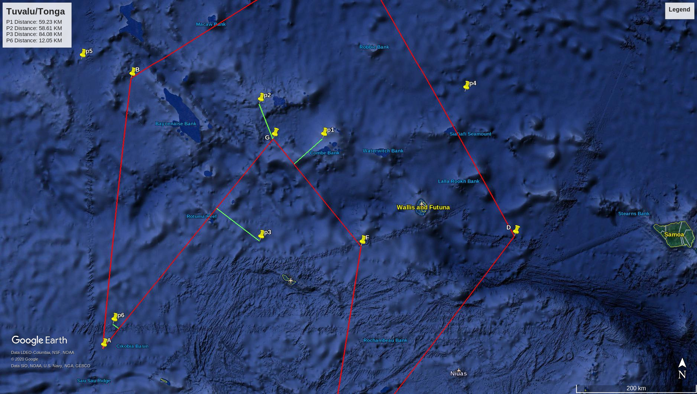
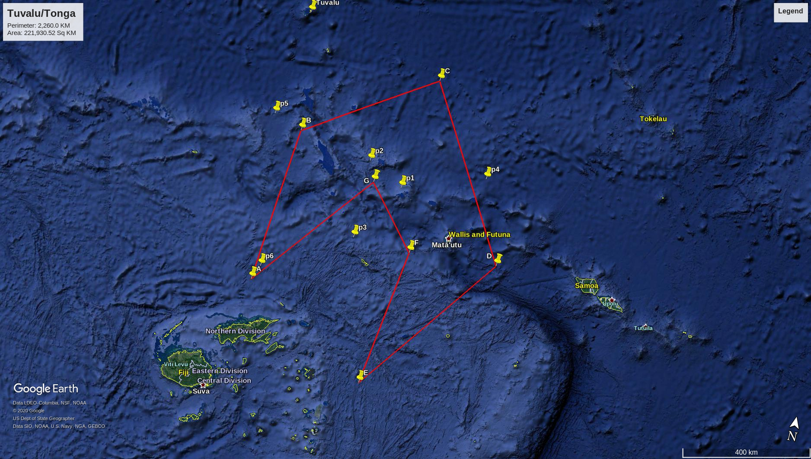

# geo-yoots

Tools for working with geometry things on Earth.

Distance Functions are implemented using spherical trigonometry and vector maths.
 - https://en.wikipedia.org/wiki/Spherical_trigonometry
 - https://mathworld.wolfram.com/SphericalCoordinates.html


Area Functions use Shoelace algorithm
 - https://en.wikipedia.org/wiki/Shoelace_formula
 - https://en.wikipedia.org/wiki/Rotation_matrix


## Features

### Distance Functions

Supported objects
1. Point to *point* distance
2. Point to *polyline* distance
3. Point to *circle* distance
4. Point to *polygon* distance

Points are (`latitude`, `longitude`) pairs. All units are kilometers.


```clojure
user=> (require '[geo-yoots.sphere.distance.core :as geo.sphere.dist])
nil

user=> (def pts
  #_=>   (list
  #_=>     [-12.338184 -177.614518]
  #_=>     [-11.851550 -178.516962]
  #_=>     [-13.764120 -178.513183]
  #_=>     [-11.670954 -175.592518]
  #_=>     [-11.188348  178.891297]
  #_=>     [-14.929683  179.326528]))
#'user/pts

user=> (def polyline
  #_=>   [[-15.290669  179.159774]
  #_=>    [-11.469978  179.626362]
  #_=>    [ -9.559677 -177.255858]])
#'user/polyline

user=> (def polygon-1
  #_=>   [[-15.290669  179.159774]
  #_=>    [-11.469978  179.626362]
  #_=>    [ -9.559677 -177.255858]
  #_=>    [-13.678565 -174.857297]
  #_=>    [-17.228967 -177.598549]
  #_=>    [-13.836214 -177.062038]
  #_=>    [-12.340054 -178.316774]])
#'user/polygon-1

user=> (def polygon-2
  #_=>   [[ 1.000000  0.000000]
  #_=>    [ 0.000000  1.000000]
  #_=>    [-1.000000  0.000000]
  #_=>    [ 0.000000 -1.000000]])
#'user/polygon-2
```

#### Point to point

```clojure
user=> (geo.sphere.dist/to-point (nth pts 0) (nth pts 1))
112.08264672107683
```

#### Point to polyline

```clojure
user=> (geo.sphere.dist/to-polyline (nth pts 0) polyline)
240.6904983870271
```

#### Point to cirlce

```clojure
(geo.sphere.distance/to-circle pt center radius)
```

#### Point to polygon

_polygon-1 above_

```clojure
user=> (require '[geo-yoots.sphere.distance.signed :as geo.sphere.sdist])
nil

user=> (clojure.pprint/pprint (map #(geo.sphere.sdist/to-polygon % polygon-1) pts))
(-59.28097835060063
 -58.534169474670456
 84.17469003085837
 42.01298834918836
 86.06814827087875
 -12.089077457271761)
nil

```

#### Distance Boolean Functions

Polyline, circle and polygon structures support distance predicates - i.e.
Are input points within `distance` to geometry.

```clojure
(def limit 1.75) ;; kilometers
(geo.sphere.dist/within-distance-to-polyline? limit pt polyline)
```

### Inclusion Tests

#### Point in polygon

*Convex and Non-Convex Simple Polygons*

```clojure
(geo.sphere.impl.inclusion/point-in-polygon? pt polygon)
```

### Area Functions

Calculate polygon areas using the `sphere.area` package.


_polygon-1 above_

```clojure
user=> (require '[geo-yoots.sphere.area.core :as geo.sphere.area])
nil

user=> (geo.sphere.area/polygon polygon-1)
221875.26084778266

user=> (geo.sphere.area/polygon polygon-2)
24740.08632334546
```


## License

Copyright © 2020 Navil Charles

Distributed under the Eclipse Public License either version 1.0 or (at
your option) any later version.
